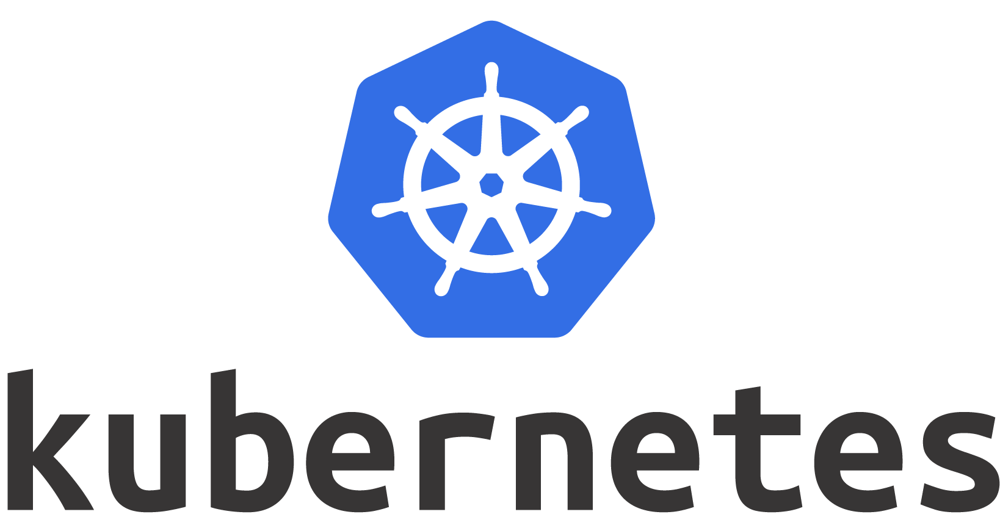

# _Autoscaling_ A Simple Web Server with __Kubernetes__

---

## Obligatory about me
- Senior Software Engineer at Mavenlink
- Bootcamp grad
- Koob noob
- Recent Kubecon attendee

---

## A _trueish_ story...

---


---

## Buzz
- A little anxious
- Likes long walks on the beach
- Likes destroying toys

---

## I want to find friends for Buzz

---

## Tinder for Dogs<sup>*</sup>

---

## A little bit of traffic...

---

## Hosted on Heroku...

---

## One developer...

---

## When suddenly...

---


---


[Receiving the Reddit "Hug of Death" blog post](https://ns1.com/blog/receiving-the-reddit-hug-of-death)

---


---

## Our developer is scrambling to keep the site online...

---

## Investors are calling...

---

## Our CEO is furious that we can't serve all these new customers...

---

## ... and dogs can't find the love they deserve.

---

## How can we stay online during increased load?

---

## Ideally with an _open source_ framework that can __scale__ with our company...

---

## With little maintenance...

---

## And with our small team...

---



---

## What we'll cover

- What is Kubernetes?
- Autoscaling in action
- How can I try it out?

---

# What is Kubernetes?

---

Kubernetes is a portable, extensible open-source platform for managing containerized workloads and services, that facilitates both declarative configuration and automation.

---

## Kubernetes Clusters

---


---


---

# Why is Kubernetes exciting?

---

# Battle tested

---

# Declarative: Configuration as code!

---

# Supported by all major cloud providers

---

# Healthy open source community

---

# Is it overkill?

---

# Autoscaling in action

---

## What do we have to do?
- Containerize our app with Docker
- Configure a Kubernetes cluster
- Write a deployment
- Write a service
- Write a horizontal pod autoscaler
- Deploy our app to the cluster!

---

```ruby

require 'sinatra'

get '/' do
  find_match_for_dog # some computationally expensive job
  "Your dog's match was found by #{ENV['POD_NAME']}"
end

```

---

## Containerizing our app

---

# What's a container anyway?

---

A container image is a _lightweight_, __stand-alone__, _executable package_ of a piece of software that includes everything needed to run it.

---

## Do you remember setting up your first development machine?

---

- Install packages
- Install languages, frameworks, and tools
- Install dependencies
- Install services (mySQL, Postgres, Redis, ElasticSearch, etc...)

---

## Once everythings installed, it's probably not the same as your production environment

---

## Containers _run anywhere_ and __have everything they need to run__

---


---

## Writing our Dockerfile

---

```dockerfile

# Specify a base image
# In this case, we want one that has Ruby preinstalled
FROM ruby:2.3.7

# Specify our working directory
WORKDIR /app

# Copy files from our current location on our local machine
# to the app directory in the Docker container
ADD . /app

# Install our dependencies
RUN cd /app && \
    bundle install

# Expose a port
EXPOSE 4567

# Start our server when the Docker container is started
CMD ["ruby", "web.rb"]

```

---

## Now that we've _containerized_ our app, we're ready to deploy it with Kubernetes

---

## We're going to write some _manifests_ that describe what our application should look like

---

## Deployment
A deployment declares your desired state of an application, usually as a series of pods and how they should be managed

---

## Pod
A pod (as in a pod of whales or pea pod) is a group of one or more containers (such as Docker containers), with shared storage/network, and a specification for how to run the containers.

---

### In laymans terms, pods are units of works or _replicas_ of an application. And deployment describes how to configure them.

---

```yaml
apiVersion: extensions/v1beta1
kind: Deployment
metadata:
  name: dog-tinder
spec:
  template:
    metadata:
      name: dog-tinder
      labels:
        service: dog-tinder
    spec:
      containers:
      - name: dog-tinder-container
        image: dog-tinder:latest
        resources:
          requests:
            cpu: 200m
        env:
        - name: POD_NAME
          valueFrom:
            fieldRef:
              fieldPath: metadata.name
      restartPolicy: Always


```

---

## What does it do?

---

```yaml
# How much resources should we allocate to this pod?
resources:
  requests:
    cpu: 200m
```

---

1/5th of a CPU core

---

## Service
A service allows other things to access your deployment. In our case we want to view our app from a browser!

---

In other case you might need to configure a service so that your app could connect to a database

---

```yaml
apiVersion: v1
kind: Service
metadata:
  labels:
    service: dog-tinder
  name: dog-tinder-service
spec:
  type: NodePort
  ports:
  - name: dog-tinder-port
    port: 4000
    protocol: TCP
    targetPort: 4567
    nodePort: 30000
  selector:
    service: dog-tinder
```

---

## Horizontal Pod Autoscaler

---

```yaml

apiVersion: autoscaling/v1
kind: HorizontalPodAutoscaler
metadata:
  name: dog-tinder-hpa
spec:
  maxReplicas: 10
  minReplicas: 1
  scaleTargetRef:
    apiVersion: extensions/v1beta1
    kind: Deployment
    name: dog-tinder
  targetCPUUtilizationPercentage: 50

```

---

`targetCPUUtilizationPercentage: 50`

50% * 200m = 100m

---

## If we use our full 200m, the HPA will try to scale to 2 pods

---

# Demo

---

# How can I learn more?

---

- [Tutorials - Kubernetes](https://kubernetes.io/docs/tutorials/)
- [Getting started with Kubernetes as an Application Developer](https://kubernetes.io/docs/user-journeys/users/application-developer/foundational/#section-2)
- [The Childrens Illustrated Guide to Kubernetes](https://deis.com/blog/2016/kubernetes-illustrated-guide/)

---

## And if you want to see all the steps for the thing I just did...

---

[http://www.noobernetes.io](http://www.noobernetes.io)

Check it out, file an issue if its confusing and I'll update it!

---

## The best way to _learn_ is to __do__

---

## Questions?
